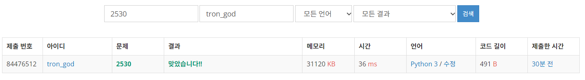

# 백준 2530.z

- ## 문제
    ### [링크](https://www.acmicpc.net/problem/2530)

    )


<br>

- ## 성공

    - ### 풀이
        - #### 시간의 덧셈 규칙을 조건문을 이용해 문제 해결

    - ### 코드

        ```python
        # 2530 인공지능 시계
        # 첫째 줄에는 현재 시각, 둘째 줄에는 요리에 필요한 시간이 초 단위로 주어질 때 끝나는 시간을 출력하는 프로그램

        hour, minute, second = map(int, input().split())
        time = int(input()) # 초 단위 입력

        new_second = second + time
        new_minute = minute + new_second // 60
        new_hour = hour + new_minute // 60

        if (new_second > 59):
            new_second = new_second % 60
            if (new_second == 60):
                new_second = 0
        if (new_minute > 59):
            new_minute = new_minute % 60
            if (new_minute == 60):
                new_minute = 0
        if (new_hour > 23):
            new_hour = new_hour % 24

        print(new_hour, new_minute, new_second)

</br>

- ## 결과

    