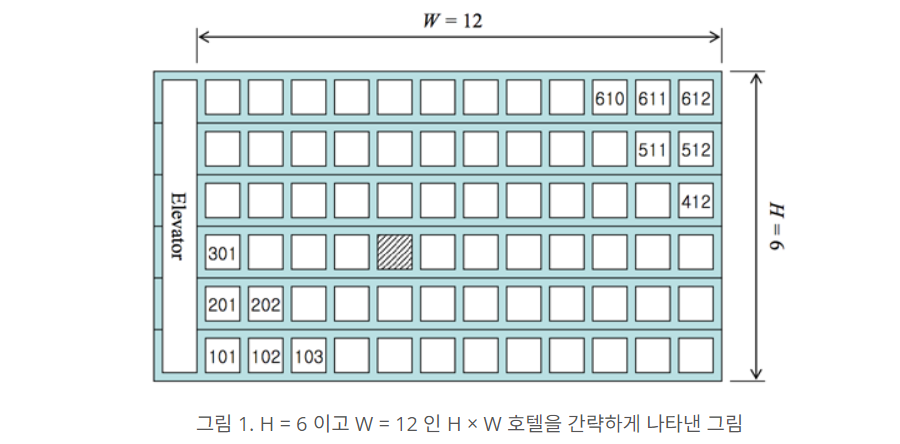

# 백준 10250.z

- ## 문제
    ### [링크](https://www.acmicpc.net/problem/10250)

    #### ACM 호텔 매니저 지우는 손님이 도착하는 대로 빈 방을 배정하고 있다. 고객 설문조사에 따르면 손님들은 호텔 정문으로부터 걸어서 가장 짧은 거리에 있는 방을 선호한다고 한다. 여러분은 지우를 도와 줄 프로그램을 작성하고자 한다. 즉 설문조사 결과 대로 호텔 정문으로부터 걷는 거리가 가장 짧도록 방을 배정하는 프로그램을 작성하고자 한다. 
    
    #### 문제를 단순화하기 위해서 호텔은 직사각형 모양이라고 가정하자. 각 층에 W 개의 방이 있는 H 층 건물이라고 가정하자 (1 ≤ H, W ≤ 99). 그리고 엘리베이터는 가장 왼쪽에 있다고 가정하자(그림 1 참고). 이런 형태의 호텔을 H × W 형태 호텔이라고 부른다. 호텔 정문은 일층 엘리베이터 바로 앞에 있는데, 정문에서 엘리베이터까지의 거리는 무시한다. 또 모든 인접한 두 방 사이의 거리는 같은 거리(거리 1)라고 가정하고 호텔의 정면 쪽에만 방이 있다고 가정한다.

    

    #### 방 번호는 YXX 나 YYXX 형태인데 여기서 Y 나 YY 는 층 수를 나타내고 XX 는 엘리베이터에서부터 세었을 때의 번호를 나타낸다. 즉, 그림 1 에서 빗금으로 표시한 방은 305 호가 된다.

    #### 손님은 엘리베이터를 타고 이동하는 거리는 신경 쓰지 않는다. 다만 걷는 거리가 같을 때에는 아래층의 방을 더 선호한다. 예를 들면 102 호 방보다는 301 호 방을 더 선호하는데, 102 호는 거리 2 만큼 걸어야 하지만 301 호는 거리 1 만큼만 걸으면 되기 때문이다. 같은 이유로 102 호보다 2101 호를 더 선호한다.

    #### 여러분이 작성할 프로그램은 초기에 모든 방이 비어있다고 가정하에 이 정책에 따라 N 번째로 도착한 손님에게 배정될 방 번호를 계산하는 프로그램이다. 첫 번째 손님은 101 호, 두 번째 손님은 201 호 등과 같이 배정한다. 그림 1 의 경우를 예로 들면, H = 6이므로 10 번째 손님은 402 호에 배정해야 한다.

<br>

- ## 성공
    
    - ### 풀이
        - #### 첫 번째 손님은 101호, 두 번재 손님은 201호 ... 인 경우, n번째 손님의 층 수는 n % H 임을 알 수 있다. H = 6일 경우에서 10 번째 손님의 층 수는 4층이다. 다음으로, 호실의 경우, 9번째 손님과 11번째 손님은 10번째 손님과 마찬가지로 2호실인 것을 알 수있다. 따라서 호실의 경우 n // H + 1 임을 알 수있다.

        - #### 층 수를 구하는 과정에서, Y = n % H 로 가정했을 경우, Y가 0이 될 수 있다. Y가 0인 경우는 n이 H의 배수일 때 이다. 위의 예시를 예로 들면 6번째 손님의 경우 601호에 배정되어야 한다. 따라서 Y가 0일 때의 조건을 다음과 같이 추가해준다.

    - ### 코드

        ```python
        # 10250 ACM 호텔

        test = int(input())

        for i in range(test):
            height, width, number = list(map(int, input().split()))

            Y = number % height
            X = number // height + 1
            if (Y == 0):
                Y = height
                X -= 1

            print(Y * 100 + X)

</br>

- ## 결과

    