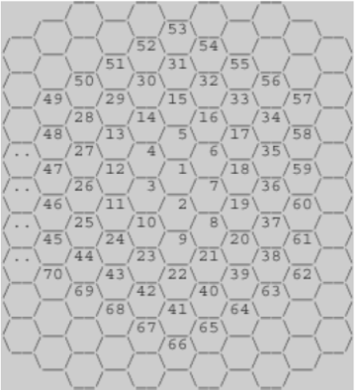
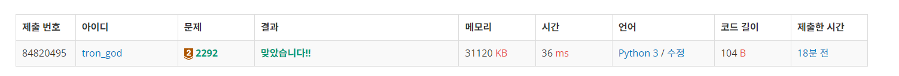

# 백준 2292.z

- ## 문제
    ### [링크](https://www.acmicpc.net/problem/2292)

    

    위의 그림과 같이 육각형으로 이루어진 벌집이 있다. 그림에서 보는 바와 같이 중앙의 방 1부터 시작해서 이웃하는 방에 돌아가면서 1씩 증가하는 번호를 주소로 매길 수 있다. 숫자 N이 주어졌을 때, 벌집의 중앙 1에서 N번 방까지 최소 개수의 방을 지나서 갈 때 몇 개의 방을 지나가는지(시작과 끝을 포함하여)를 계산하는 프로그램을 작성하시오. 예를 들면, 13까지는 3개, 58까지는 5개를 지난다.


<br>

- ## 성공

    - ### 풀이
        - 수학적인 규칙을 통해 문제를 해결하였다. 2 ~ 7번 방의 경우엔 2개의 방을 지나고, 8 ~ 19번 방의 경우엔 3개의 방을 지난다.
        - 각 구간의 최댓값을 확인해보면 7 = 1 + 6 * 1, 19 = 7 + 6 * 2, ... 임을 확인 할 수있다.
        - 위의 규칙을 적용하여 입력받은 num의 값이 각 구간의 최댓값(7, 19, ...)보다 클 경우 cnt을 하나씩 증가시킨 후 6을 곱한 값과 비교하여 반복을 진행할 수 있도록 하였다.

    - ### 코드

        ```python
        # 2292 벌집

        num = int(input())
        numbox = 1
        cnt = 1

        while (num > numbox):
            numbox += 6 * cnt
            cnt += 1
        print(cnt)

</br>

- ## 결과

    