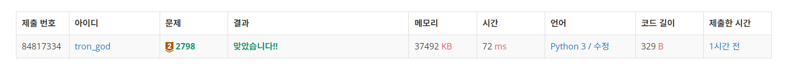

# 백준 2798.z

- ## 문제
    ### [링크](https://www.acmicpc.net/problem/2798)

    카지노에서 제일 인기 있는 게임 블랙잭의 규칙은 상당히 쉽다. 카드의 합이 21을 넘지 않는 한도 내에서, 카드의 합을 최대한 크게 만드는 게임이다. 블랙잭은 카지노마다 다양한 규정이 있다.

    한국 최고의 블랙잭 고수 김정인은 새로운 블랙잭 규칙을 만들어 상근, 창영이와 게임하려고 한다.

    김정인 버전의 블랙잭에서 각 카드에는 양의 정수가 쓰여 있다. 그 다음, 딜러는 N장의 카드를 모두 숫자가 보이도록 바닥에 놓는다. 그런 후에 딜러는 숫자 M을 크게 외친다.

    이제 플레이어는 제한된 시간 안에 N장의 카드 중에서 3장의 카드를 골라야 한다. 블랙잭 변형 게임이기 때문에, 플레이어가 고른 카드의 합은 M을 넘지 않으면서 M과 최대한 가깝게 만들어야 한다.

    N장의 카드에 써져 있는 숫자가 주어졌을 때, M을 넘지 않으면서 M에 최대한 가까운 카드 3장의 합을 구해 출력하시오.


<br>

- ## 성공

    - ### 풀이
        - card 리스트에서 3장의 카드를 뽑아 합을 구하는 방식을 먼저 생각하였다. 3중 반복문을 이용하여 0, 1, 2 번 인덱스 추출을 시작으로 n-2, n-1, n 번 인덱스 까지의 합을 구하였다.
        - 구한 합(sum)을 sum_list에 저장하여 리스트 내 가장 큰 수를 출력하였다.

    - ### 코드

        ```python
        # 2798 블랙잭

        num, max_num = map(int, input().split())
        card = list(map(int, input().split()))
        l = len(card)

        sum_list = []
        for i in range(l-2):
            for j in range(i+1, l-1):
                for k in range(j+1, l):
                    sum = card[i] + card[j] + card[k]
                    if (sum <= max_num):
                        sum_list.append(sum)

        print(max(sum_list))

</br>

- ## 결과

    