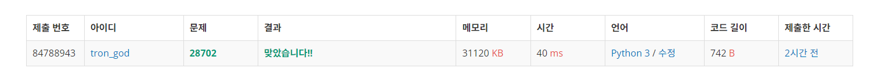

# 백준 29702.z

- ## 문제
    ### [링크](https://www.acmicpc.net/problem/29702)

    #### FizzBuzz 문제는 $i = 1, 2, \cdots$ 에 대해 다음 규칙에 따라 문자열을 한 줄에 하나씩 출력하는 문제입니다.
    - $i$가 3의 배수이면서 5의 배수이면 "FizzBuzz를 출력합니다.
    - $i$가 3의 배수이지만 5의 배수가 아니면 "Fizz"를 출력합니다.
    - $i$가 3의 배수가 아니지만 5의 배수이면 "Buzz"를 출력합니다.
    - $i$가 3의 배수도 아니고 5의 배수도 아닌 경우 $i$를 그대로 출력합니다.
     
    #### FizzBuzz 문제에서 연속으로 출력된 세 개의 문자열이 주어집니다. 이때, 이 세 문자열 다음에 올 문자열은 무엇일까요?


<br>

- ## 성공

    - ### 풀이
        - #### 먼저 입력받은 세 문자열에 따라 case를 나누어 case에 맞는 결과를 출력할 수 있도록 하였다. 
        - #### 정수가 입력된 case에서 정수가 입력된 위치를 구하여 세 문자열 이후에 나올 숫자를 알아낼 수 있도록 하였다. 
        - #### 문제 내에서 3의 배수는 "Fizz", 5의 배수는 "Buzz", 3의 배수이면서 동시에 5의 배수, 즉 15의 배수이면 "FizzBuzz"로 정의하였다. 따라서 1 ~ 15의 수 마다 규칙이 반복된다는 점을 이용하였다.

    - ### 코드

        ```python
        case = []

        # case 리스트 만들기
        for i in range(3):
        word = input()
    
            if (word == "FizzBuzz"):
                case.append("fb")
            elif (word == "Fizz"):
                case.append("f")
            elif (word == "Buzz"):
                case.append("b")
            else:
                num = int(word)
                case.append("n")

        # case리스트 내 정수의 위치 확인
        for i in range(len(case)):
            if(case[i] == "n"):
                pos = 3 - i

        # 결과값의 위치(1 ~ 15) num의 수에 따라 result가 결정 됨
        for i in range (1, 16):
            if (i == num % 15):
                result_pos = i + pos
                result = result_pos + (num // 15) * 15

        def final(n):
            if (n % 3 == 0) & (n % 5 == 0):
                print("FizzBuzz")
            elif (n % 3 == 0) & (n % 5 != 0):
                print("Fizz")
            elif (n % 5 == 0) & (n % 3 != 0):
                print("Buzz")
            else:
                print(n)

        final(result)

</br>

- ## 결과

    