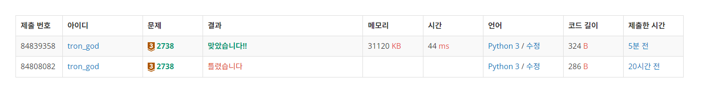

# 백준 2738.z

- ## 문제
    ### [링크](https://www.acmicpc.net/problem/2738)

    N*M크기의 두 행렬 A와 B가 주어졌을 때, 두 행렬을 더하는 프로그램을 작성하시오.


<br>

- ## 성공

    - ### 풀이
        - 한 줄에 한 행씩 입력을 받으므로 N번 반복마다 빈 리스트(A, B)에 입력을 리스트 형식으로 받아 저장하였다.
        - 모든 입력을 마친 후, 두 리스트는 2차원 형태로 저장될 것이다. 2차원 리스트의 원소를 각각 합하여 출력하였다.

    - ### 코드

        ```python
        # 2738 행렬 덧셈

        A = []
        B = []

        N, M = map(int, input().split())

        for i in range(N):
            row = list(map(int, input().split()))
            A.append(row)

        for i in range(N):
            row = list(map(int, input().split()))
            B.append(row)

        for i in range(N):
            for j in range(M):
                sum = A[i][j] + B[i][j]
                print(sum, end = ' ')
            print()

</br>

- ## 결과

    