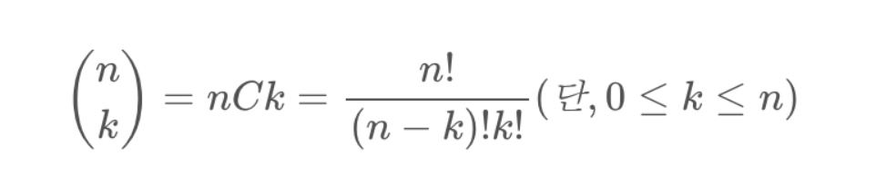

# 백준 11050.z

- ## 문제
    ### [링크](https://www.acmicpc.net/problem/11050)

    자연수 N과 정수 K가 주어졌을 때 이항 계수를 구하는 프로그램을 작성하시오.

<br>

- ## 성공

    - ### 풀이
        - 
        - 이항 계수는 조합의 갯수로 표현할 수 있다.
        - 파이썬의 math함수를 이용하여 구현하였다.

    - ### 코드

        ```python
        # 11050 이항 계수 1

        import math

        a, b = map(int, input().split())

        def bino_coef_factorial(n, k):
	        return math.factorial(n) // (math.factorial(n-k) * math.factorial(k))

        print(bino_coef_factorial(a, b))


</br>

- ## 결과

    