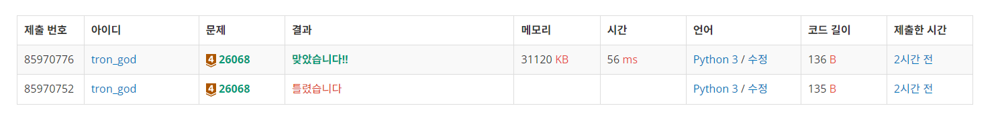

# 백준 26068.z

- ## 문제
    ### [링크](https://www.acmicpc.net/problem/26068)

    마음씨 착한 곰곰이는 임스에게 치킨 기프티콘을 여러 번 선물했다.

    기프티콘이 있다는 사실을 잊고 있던 임스는 치킨 댄스를 추는 곰곰이를 보고 그 사실이 생각났다.

    치킨 기프티콘을 선물받은 횟수 $N$과 선물의 남은 유효기간이 주어질 때, 임스가 사용할 기프티콘의 개수를 구하시오.

    임스는 기프티콘을 아껴 사용하기 위해 유효기간이 90일 이하로 남은 기프티콘만 사용할 것이다.

<br>

- ## 성공

    - ### 풀이
        - 입력으로 받는 문자열에서 숫자만을 분리한 뒤 90이하인 경우를 판별하여 count를 증가시켰다.

    - ### 코드

        ```python
        # 26068 치킨댄스를 추는 곰곰이를 본 임스 2

        n = int(input())

        count = 0
        for i in range(n):
            d, num = input().split('-')
            if (int(num) <= 90):
                count += 1

        print(count)


</br>

- ## 결과

    