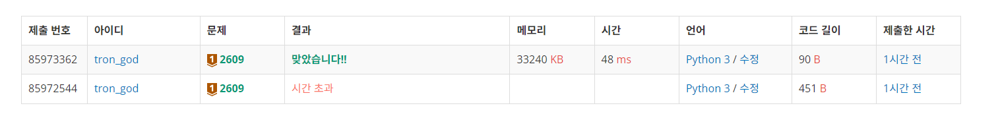

# 백준 2609.z

- ## 문제
    ### [링크](https://www.acmicpc.net/problem/2609)

    두 개의 자연수를 입력받아 최대 공약수와 최소 공배수를 출력하는 프로그램을 작성하시오.

<br>

- ## 성공

    - ### 풀이
        - 두 수의 최대공약수와 최소공배수를 구하는 유클리드 호제법을 사용하여 문제를 해결하였다.

    - ### 코드

        ```python
        # 2609 최대공약수와 최소공배수

        a, b = map(int, input().split())

        def gcd(a, b):
            while b > 0:
                a, b = b, a % b
            return a

        def lcm(a, b):
            return a * b // gcd(a, b)

        print(gcd(a, b))
        print(lcm(a, b))


</br>

- ## 결과

    