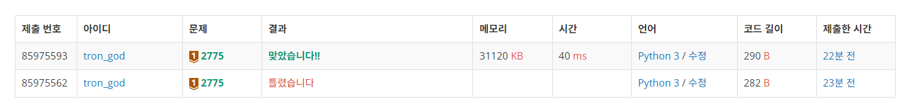

# 백준 2775.z

- ## 문제
    ### [링크](https://www.acmicpc.net/problem/2775)

    평소 반상회에 참석하는 것을 좋아하는 주희는 이번 기회에 부녀회장이 되고 싶어 각 층의 사람들을 불러 모아 반상회를 주최하려고 한다.

    이 아파트에 거주를 하려면 조건이 있는데, “a층의 b호에 살려면 자신의 아래(a-1)층의 1호부터 b호까지 사람들의 수의 합만큼 사람들을 데려와 살아야 한다” 는 계약 조항을 꼭 지키고 들어와야 한다.

    아파트에 비어있는 집은 없고 모든 거주민들이 이 계약 조건을 지키고 왔다고 가정했을 때, 주어지는 양의 정수 k와 n에 대해 k층에 n호에는 몇 명이 살고 있는지 출력하라. 단, 아파트에는 0층부터 있고 각층에는 1호부터 있으며, 0층의 i호에는 i명이 산다.

<br>

- ## 성공

    - ### 풀이
        - 0층에 1 ~ n까지의 리스트를 생성, 1층의 n호는 0층의 1 ~ n의 합이다.
        - 이를 이용하여 반복문을 사용하여 문제 해결

    - ### 코드

        ```python
        # 2775 부녀회장이 될테야

        T = int(input())

        floor = []
        for i in range(T):
            k = int(input())
            n = int(input())
    
            floor_0 = [x for x in range(1, n+1)]
            for j in range(k):
                for k in range(n):
                    floor.append(sum(floor_0[:k+1]))
                floor_0 = floor.copy()
            print(floor[-1])


</br>

- ## 결과

    