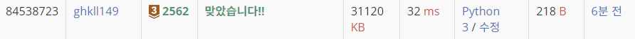

# 백준2562번 최댓값

### 문제

- 9개의 서로 다른 자연수가 주어질 때, 이들 중 최댓값을 찾고 그 최댓값이 몇 번째 수인지를 구하는 프로그램을 작성하시오.
  예를 들어, 서로 다른 9개의 자연수 3, 29, 38, 12, 57, 74, 40, 85, 61 이 주어지면, 이들 중 최댓값은 85이고, 이 값은 8번째 수이다.

---

### 입력

- 첫째 줄부터 아홉 번째 줄까지 한 줄에 하나의 자연수가 주어진다. 주어지는 자연수는 100 보다 작다.

### 출력

- 첫째 줄에 최댓값을 출력하고, 둘째 줄에 최댓값이 몇 번째 수인지를 출력한다.

### 코드

```python
#a 배열
a = []
# a에 하나씩 입력
for i in range(9):
  a.append(int(input()))


#최대값, ?번째 수 0값으로 초기화
max = 0; num_index =0

for i in range(len(a)):
  if a[i] > max:
    max = a[i]
    num_index = a.index(a[i])
  else:
    pass

print(max)
print(num_index+1)

```

---

### 결과


