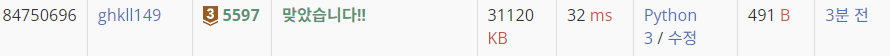

# 백준5597번 과제 안 내신 분..?

### 문제

- X대학 M교수님은 프로그래밍 수업을 맡고 있다. 교실엔 학생이 30명이 있는데, 학생 명부엔 각 학생별로 1번부터 30번까지 출석번호가 붙어 있다. 교수님이 내준 특별과제를 28명이 제출했는데, 그 중에서 제출 안 한 학생 2명의 출석번호를 구하는 프로그램을 작성하시오.

---

### 코드

```python
student = []
absentStudent = []

for i in range(28):
  student.append(int(input()))
for i in range(1, 31):
  if i not in student:      # 30명중 없는 학생 찾기
    absentStudent.append(i)  #absentStudent 배열에 추가해라

print(min(absentStudent))
print(max(absentStudent))


# 생각하지 못한 다른 방법 (숫자를 제거하는 방법)
# student = [i for i in range(1, 31)]
# for i in range(28):
#   data = int(input())
#   student.remove(data)
# print(min(student))
# print(max(student))

```

---

### 결과


